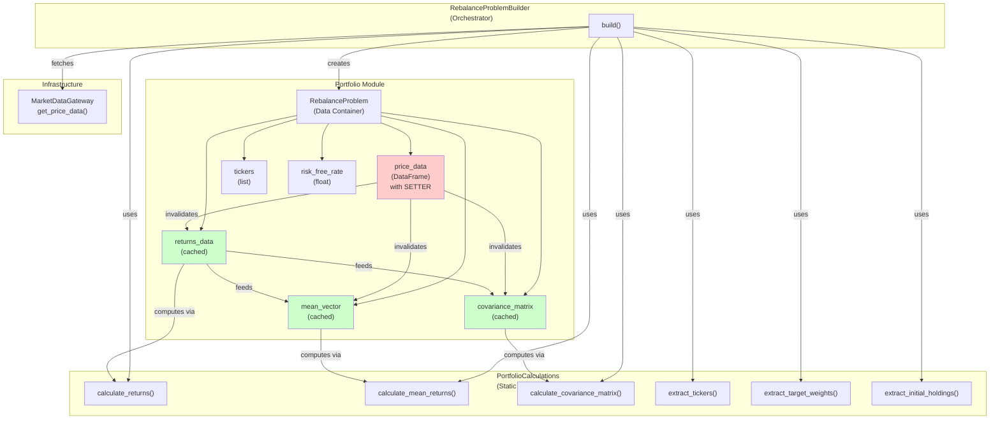
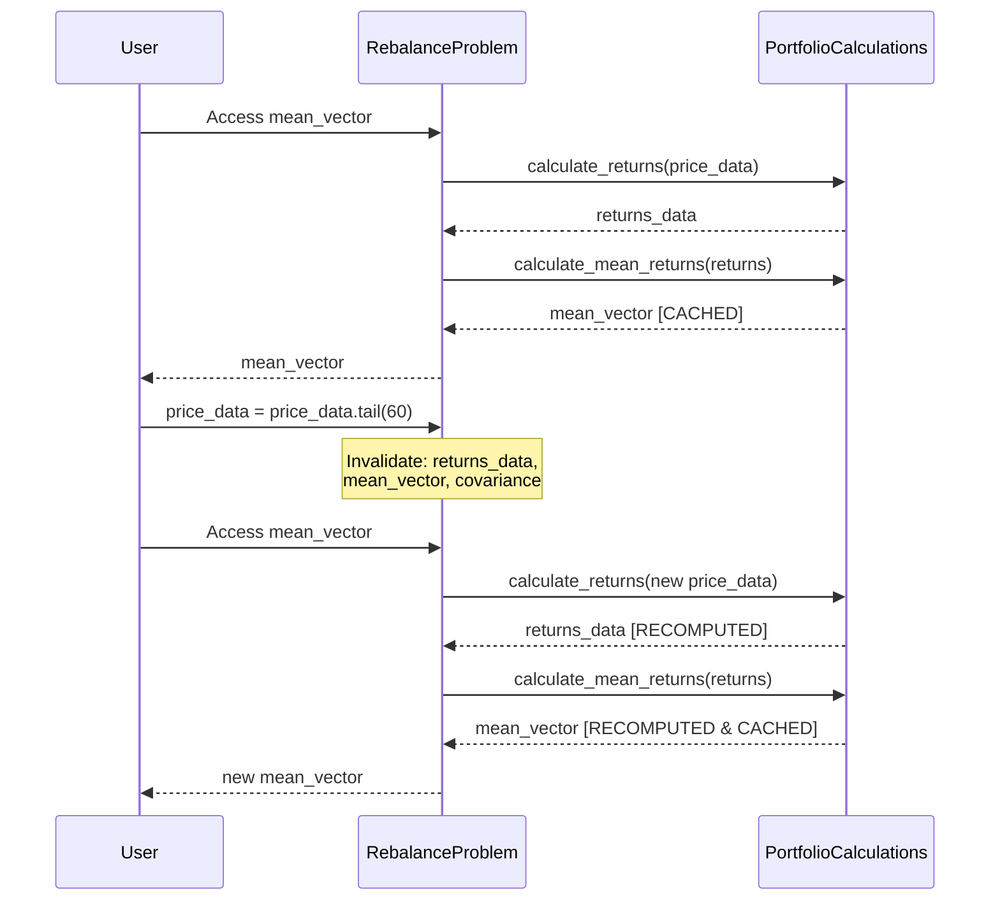

# Portfolio Architecture Diagram

```mermaid
graph TB
    subgraph Portfolio["Portfolio Module"]
        RP["RebalanceProblem<br/>(Data Container)"]
        
        PriceData["price_data<br/>(DataFrame)<br/>with SETTER"]
        Tickers["tickers<br/>(list)"]
        RFR["risk_free_rate<br/>(float)"]
        
        ReturnsData["returns_data<br/>(cached)"]
        MeanVector["mean_vector<br/>(cached)"]
        CovMatrix["covariance_matrix<br/>(cached)"]
        
        RP --> PriceData
        RP --> Tickers
        RP --> RFR
        RP --> ReturnsData
        RP --> MeanVector
        RP --> CovMatrix
        
        PriceData -->|invalidates| ReturnsData
        PriceData -->|invalidates| MeanVector
        PriceData -->|invalidates| CovMatrix
        
        ReturnsData -->|feeds| MeanVector
        ReturnsData -->|feeds| CovMatrix
    end
    
    subgraph Builder["RebalanceProblemBuilder<br/>(Orchestrator)"]
        B["build()"]
    end
    
    subgraph Infrastructure["Infrastructure"]
        Gateway["MarketDataGateway<br/>get_price_data()"]
    end
    
    subgraph Calculations["PortfolioCalculations<br/>(Static Utilities)"]
        CalcReturns["calculate_returns()"]
        CalcMean["calculate_mean_returns()"]
        CalcCov["calculate_covariance_matrix()"]
        ExtractT["extract_tickers()"]
        ExtractW["extract_target_weights()"]
        ExtractH["extract_initial_holdings()"]
    end
    
    B -->|fetches| Gateway
    B -->|uses| CalcReturns
    B -->|uses| CalcMean
    B -->|uses| CalcCov
    B -->|uses| ExtractT
    B -->|uses| ExtractW
    B -->|uses| ExtractH
    B -->|creates| RP
    
    ReturnsData -->|computes via| CalcReturns
    MeanVector -->|computes via| CalcMean
    CovMatrix -->|computes via| CalcCov
    
    style PriceData fill:#ffcccc
    style ReturnsData fill:#ccffcc
    style MeanVector fill:#ccffcc
    style CovMatrix fill:#ccffcc
```

## Data Flow: Slicing Example

```mermaid
sequenceDiagram
    participant User
    participant RP as RebalanceProblem
    participant PC as PortfolioCalculations
    
    User->>RP: Access mean_vector
    RP->>PC: calculate_returns(price_data)
    PC-->>RP: returns_data
    RP->>PC: calculate_mean_returns(returns)
    PC-->>RP: mean_vector [CACHED]
    RP-->>User: mean_vector
    
    User->>RP: price_data = price_data.tail(60)
    Note over RP: Invalidate: returns_data,<br/>mean_vector, covariance
    
    User->>RP: Access mean_vector
    RP->>PC: calculate_returns(new price_data)
    PC-->>RP: returns_data [RECOMPUTED]
    RP->>PC: calculate_mean_returns(returns)
    PC-->>RP: mean_vector [RECOMPUTED & CACHED]
    RP-->>User: new mean_vector
```
