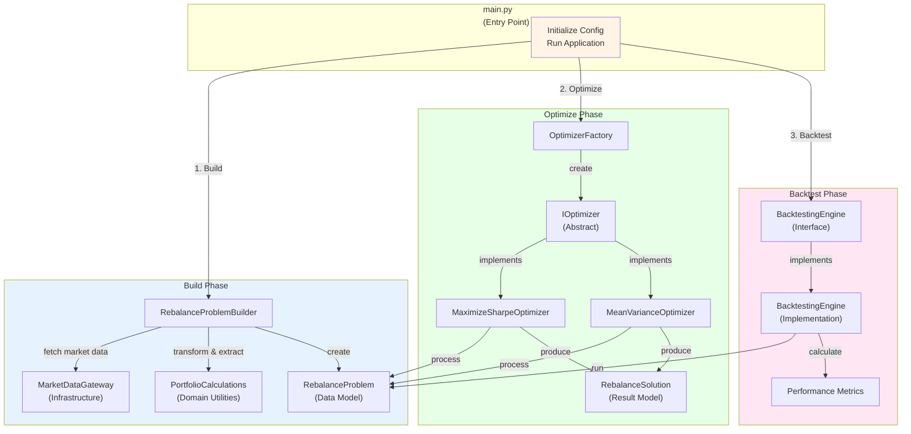
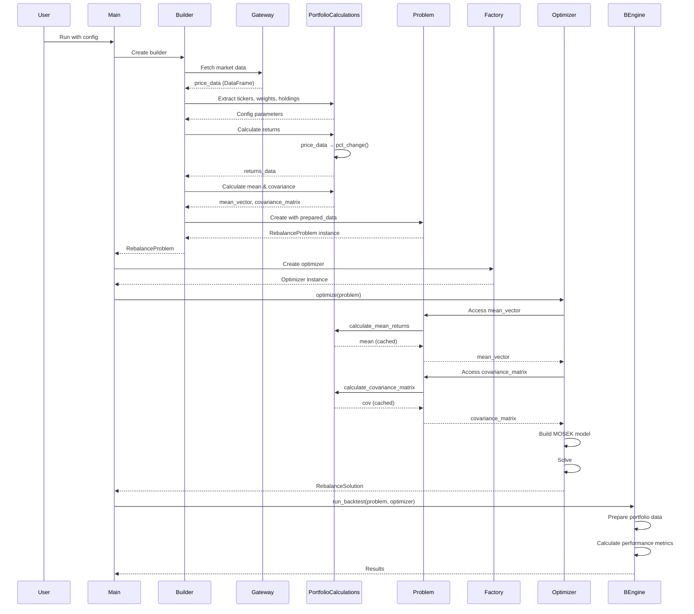
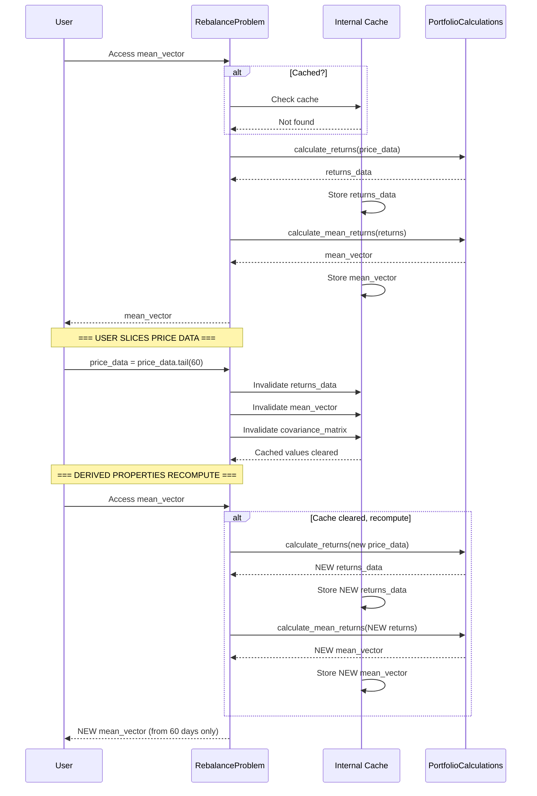
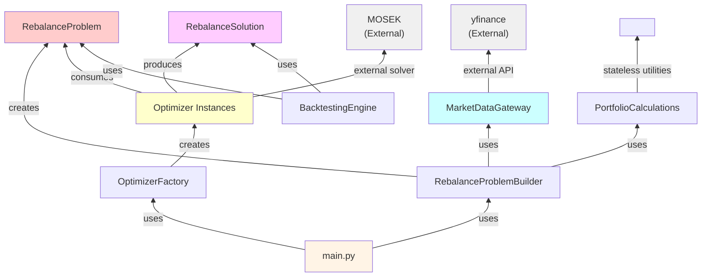

# Portfolio Optimizer - Complete System Architecture

## High-Level System Architecture



## Detailed Module Architecture

```mermaid
graph LR
    subgraph Infrastructure["Infrastructure Layer<br/>(External Systems)"]
        Gateway["MarketDataGateway<br/>├─ get_price_data<br/>└─ Uses: yfinance"]
    end
    
    subgraph Portfolio["Portfolio Domain<br/>(src/portfolio/)"]
        Problem["RebalanceProblem<br/>├─ tickers<br/>├─ price_data ⚙️ REACTIVE<br/>├─ returns_data 💾<br/>├─ mean_vector 💾<br/>├─ covariance_matrix 💾<br/>├─ risk_free_rate<br/>├─ target_weights<br/>└─ initial_holdings"]
        
        Builder["RebalanceProblemBuilder<br/>├─ Fetch market data<br/>├─ Transform returns<br/>├─ Calculate statistics<br/>├─ Extract parameters<br/>└─ Build RebalanceProblem"]
        
        Calc["PortfolioCalculations<br/>├─ calculate_returns<br/>├─ calculate_mean_returns<br/>├─ calculate_covariance_matrix<br/>├─ extract_tickers<br/>├─ extract_target_weights<br/>└─ extract_initial_holdings"]
    end
    
    subgraph Optimization["Optimization Layer<br/>(src/core/optimizers/)"]
        IOptimizer["IOptimizer<br/>(Abstract Base)"]
        
        MaxSharpe["MaximizeSharpeOptimizer<br/>├─ MOSEK Model<br/>├─ Variable: y<br/>├─ Constraint: adjusted returns<br/>└─ Objective: minimize variance"]
        
        MeanVar["MeanVarianceOptimizer<br/>├─ Efficient frontier<br/>└─ Placeholder"]
        
        DecisionVars["DecisionVariables<br/>├─ Portfolio weights<br/>└─ Auxiliary variables"]
        
        Factory["OptimizerFactory<br/>├─ maximize_sharpe<br/>└─ mean_variance"]
    end
    
    subgraph Models["Data Models<br/>(src/models/)"]
        Solution["RebalanceSolution<br/>├─ total_trades<br/>└─ target_weights"]
    end
    
    subgraph Backtesting["Backtesting Layer<br/>(src/backtesting/)"]
        BInterface["BacktestingEngineInterface"]
        BEngine["BacktestingEngine<br/>├─ run_backtest<br/>├─ _prepare_portfolio_data<br/>└─ _calculate_performance_metrics"]
    end
    
    Gateway -->|provides| Builder
    Builder -->|uses| Calc
    Builder -->|creates| Problem
    Calc -->|computes| Problem
    
    Problem -->|input to| Factory
    Factory -->|instantiates| IOptimizer
    IOptimizer -->|base of| MaxSharpe
    IOptimizer -->|base of| MeanVar
    MaxSharpe -->|uses| DecisionVars
    MeanVar -->|uses| DecisionVars
    MaxSharpe -->|produces| Solution
    MeanVar -->|produces| Solution
    
    Solution -->|input to| BInterface
    BInterface -->|implements| BEngine
    BEngine -->|analyzes| Problem
    
    style Problem fill:#ffcccc
    style Builder fill:#ccffcc
    style Calc fill:#ccffcc
    style IOptimizer fill:#ffffcc
    style Solution fill:#ffccff
    style BEngine fill:#ccffff
```



## Data Flow: Complete Application Lifecycle



## Reactivity Example: Slicing Price Data



## Key Design Patterns

### 1. **Abstract Factory Pattern** (Optimizers)
- `IOptimizer` abstract base class
- `OptimizerFactory` creates concrete implementations
- Enables pluggable optimizer strategies

### 2. **Builder Pattern** (RebalanceProblemBuilder)
- Orchestrates complex object construction
- Separates data fetching, transformation, validation
- Returns fully-prepared `RebalanceProblem`

### 3. **Reactive Properties** (RebalanceProblem)
- `price_data` setter invalidates dependent cached values
- On-demand computation with caching for performance
- Automatic recomputation when data changes

### 4. **Layered Architecture**
- **Infrastructure**: External systems (market data)
- **Portfolio**: Domain logic and data structures
- **Core/Optimizers**: Optimization algorithms (MOSEK)
- **Backtesting**: Performance analysis
- **Models**: Data transfer objects

## Component Dependencies



## File Organization

```
src/
├── main.py                          # Application entry point
├── config/                          # Configuration (future use)
├── core/
│   └── optimizers/
│       ├── ioptimizer.py           # Abstract base
│       ├── optimizer_factory.py    # Factory pattern
│       ├── maximize_sharp_optimizer/
│       │   ├── maximize_sharpe.py  # MOSEK implementation
│       │   └── decision_variables_max_sharpe.py
│       └── mean_variance_optimizer/
│           └── mean_variance_optimizer.py
├── infrastructure/
│   └── market_data/
│       └── marketdatagateway.py     # yfinance wrapper
├── portfolio/
│   ├── rebalance_problem.py         # Reactive data container
│   ├── rebalance_problem_builder.py # Orchestrator
│   └── portfolio_calculations.py    # Domain utilities
├── models/
│   └── rebalance_solution.py        # Solution model
└── backtesting/
    └── backtesting_engine.py        # Performance analysis
```
